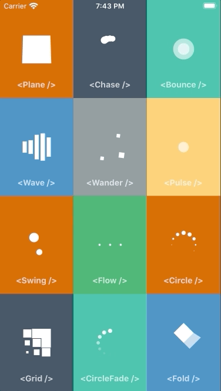

# React Native Animated SpinKit

[](https://npm.im/react-native-animated-spinkit) [](./LICENSE)

A pure JavaScript port of [SpinKit](https://github.com/tobiasahlin/SpinKit) for React Native.



## Why Another Port?

The previous port of [SpinKit](https://github.com/tobiasahlin/SpinKit) for React Native ([react-native-spinkit](https://github.com/maxs15/react-native-spinkit)) is a native module so it requires extra native dependencies and can't be used in [Expo](https://expo.io) projects without ejecting.

This library is a pure JavaScript port of SpinKit implemented with the [Animated](https://facebook.github.io/react-native/docs/animated) API, which means you can use it in any React Native project and the spinners will look identical on Android and iOS.

## Installation

```sh
yarn add react-native-animated-spinkit
```

or

```sh
npm install react-native-animated-spinkit
```

## Usage

```js
import { Plane } from 'react-native-animated-spinkit'

function App() {
  return (
    <View style={styles.container}>
      <Plane size={48} color="#FFF">
    </View>
  )
}
```

## Props

Inherits [View Props](https://facebook.github.io/react-native/docs/view#props)

### size

> `number` | defaults to `48`

Width and height of the spinner.

### color

> `string` | defaults to `#000`

Color of the spinner.

### animating

> `boolean` | defaults to `true`

Whether to show the indicator or hide it.

### hidesWhenStopped

> `boolean` | defaults to `true`

Whether the indicator should hide when not animating.

## Spinners

All the spinners from [SpinKit](https://github.com/tobiasahlin/SpinKit) have been ported.

- `<Plane />`
- `<Chase />`
- `<Bounce />`
- `<Wave />`
- `<Pulse />`
- `<Flow />`
- `<Swing />`
- `<Circle />`
- `<CircleFade />`
- `<Grid />`
- `<Fold />`
- `<Wander />`

## Example

To run the example project, follow these steps:

- Clone the repo
- Run these commands

```sh
yarn
cd example
yarn && yarn start
```
